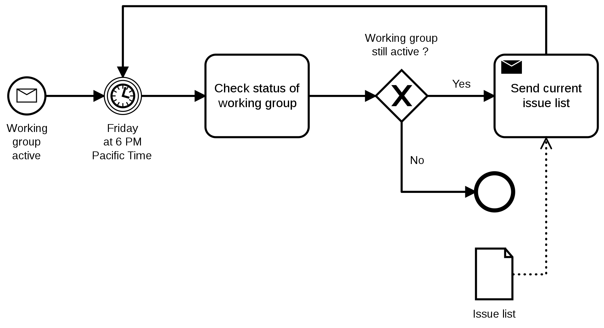

# Complex process

## Description

Look at the following image, that is, at the time this example was writed, the article's main image from English Wikipedia page https://en.wikipedia.org/wiki/Business_Process_Model_and_Notation (it's necessary to cite the author: Mikelo Skarabo - Own work, CC BY-SA 4.0, https://commons.wikimedia.org/w/index.php?curid=91302590).



The same workflow can be reproduced almost entirely with BPMNator. Look at `complex-process.yaml` file.

```YAML
process: Example from English Wikipedia "BPMN" page
activities:
  Working group activities:
    type: inmcatch
    goto: Friday at 6 PM Pacific Time
  Friday at 6 PM Pacific Time:
    type: intimer
    goto: Check status of working group
  Check status of working group:
    xgoto:
      - if: ${active}
        then: Send current issue list
      - if: ${!active}
  Send current issue list:
    type: send
    goto: Friday at 6 PM Pacific Time
```

The only difference between the original process and this BPMNator-generated one, is the lack of the DataObject element (represented by a sheet icon) because it's not supported and needs to be added inside a visual editor.

So the resulting process has this aspect:


## Example usage
Fastest way to launch this example is through BPMNator CLI:

```BASH
node   dist/bin/bpmnator   examples/8.\ complex\ process/complex-process.yaml   examples/8.\ complex\ process/complex-process.bpmn
```